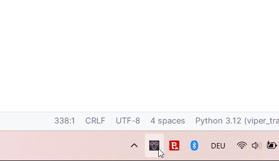
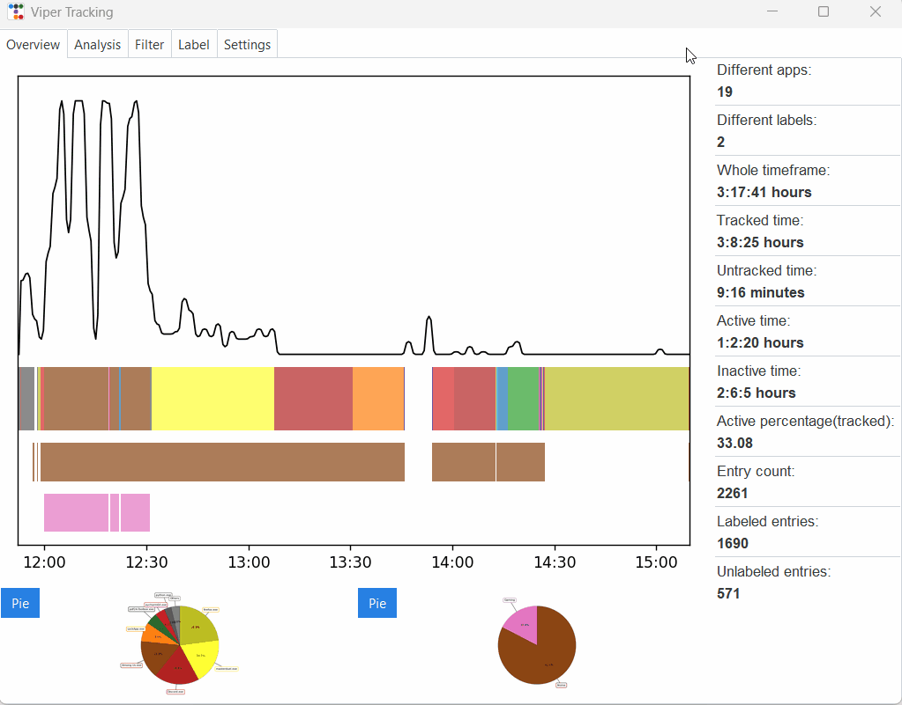
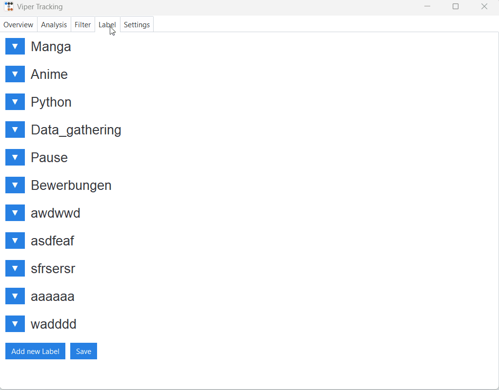
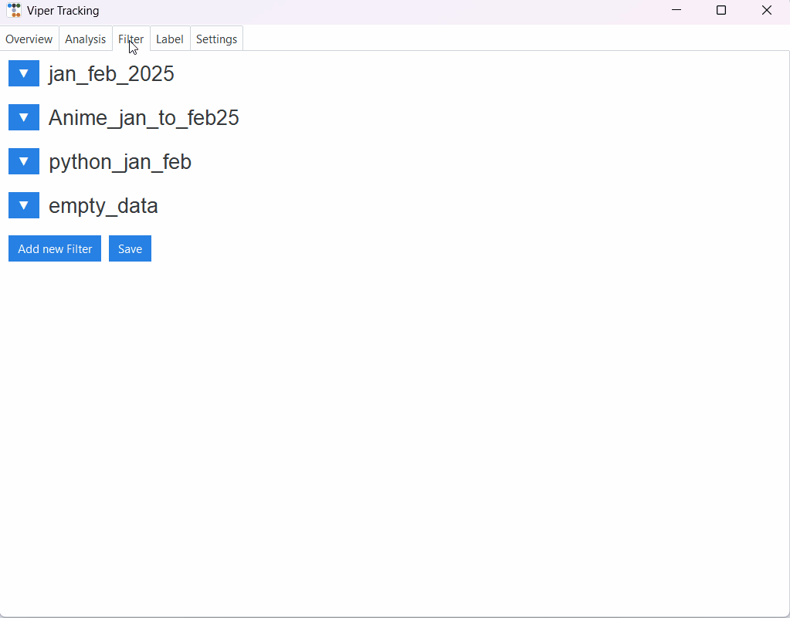
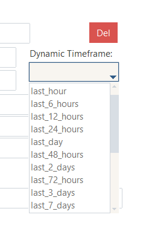
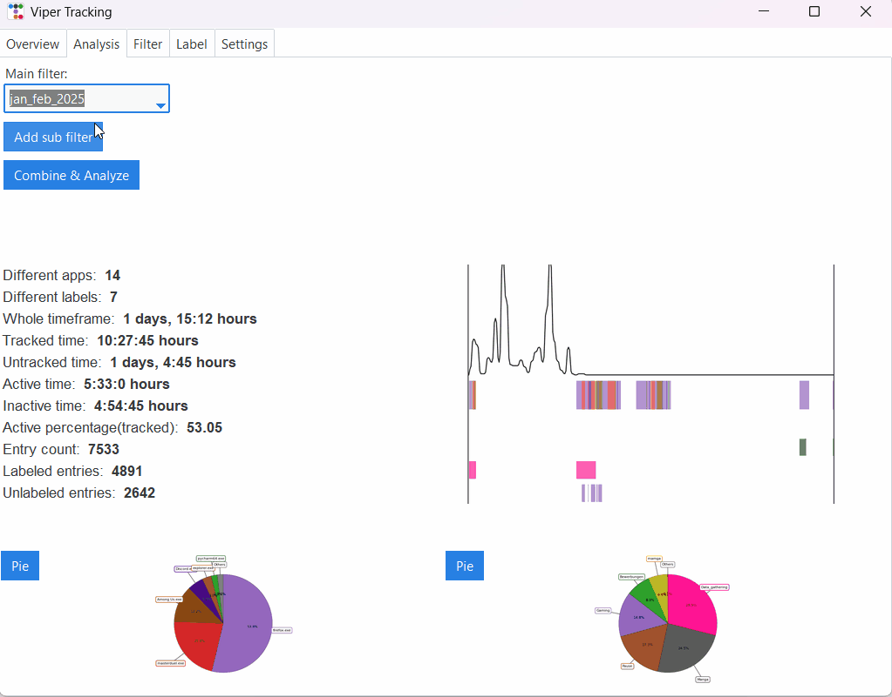
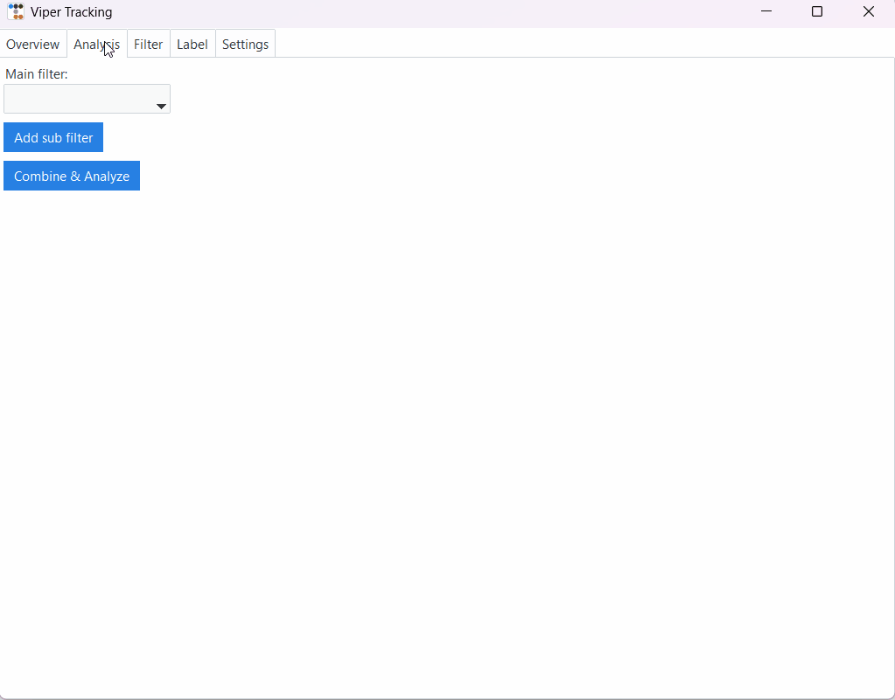
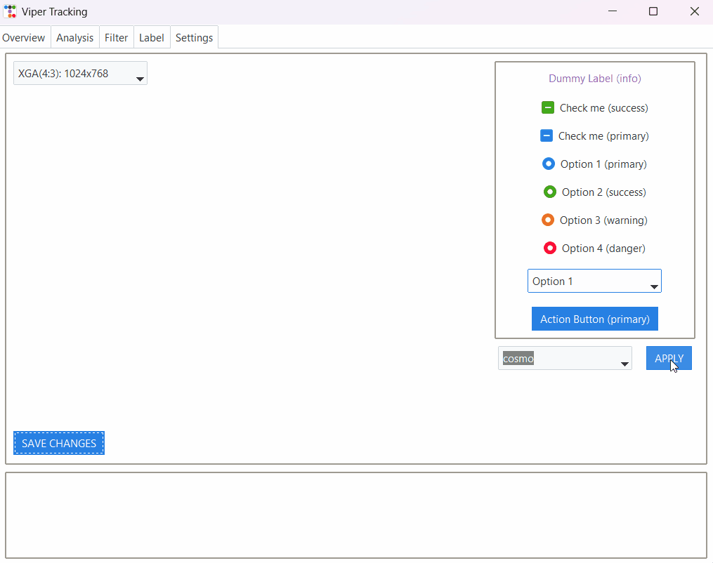
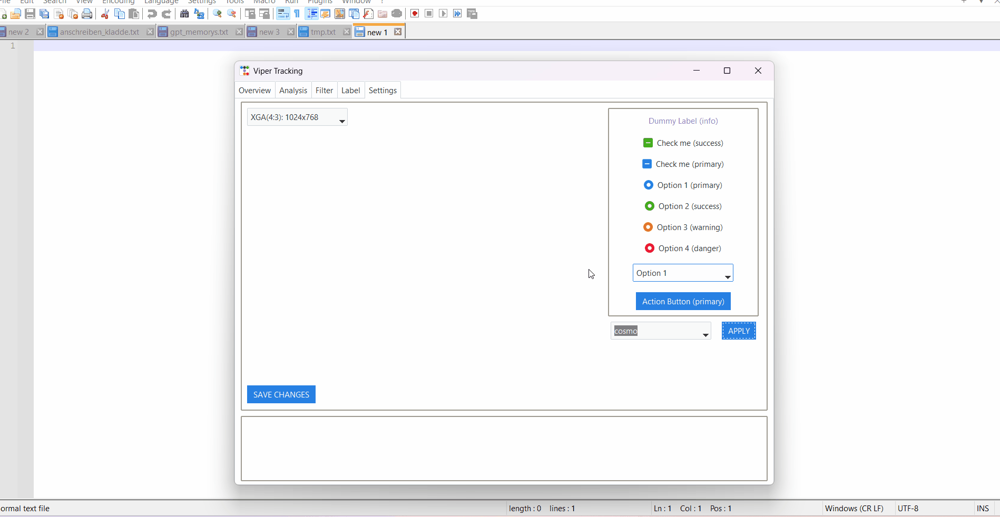

# Viper Tracking – Feature Showcase  
**Presentation Version · Pre Open Beta**

---

## Table of Contents

1. [System Tray and Manual Labels](#system-tray-and-manual-labels)  
2. [Main View and Interactive Graphs](#main-view-and-interactive-graphs)  
3. [Labels](#labels)  
4. [Filters](#filters)  
5. [Using Filters](#using-filters)  
6. [User Settings and Themes](#user-settings-and-themes)  
7. [Final Words](#final-words)

---

## System Tray and Manual Labels

This example shows the program running in the background with quick access to enable/disable manual labels.  
The actual "close application" function is hidden behind a submenu to prevent accidental shutdowns.

---

## Main View and Interactive Graphs

When opening the GUI from the system tray, this is what you'll see.  
The main graph displays your activity timeline: which apps were used when, and which labels (if any) were active.

Below the graph are interactive thumbnails - clicking them opens overlays for apps and labels.  
(See [Using Filters](#using-filters) for details.)

> **Note:** Color assignment is currently automatic and ensures visual distinction. In future versions,  
> users will be able to customize all label/app colors and set a default for new entries.

---

## Labels

This section demonstrates how the label interface works.  
Labels can be expanded or collapsed as needed. The system supports complex logic using `AND` and `OR` combinations.

Border colors visually indicate whether a label block is part of an `AND` or `OR` group.  
No need for complicated regex - the UI is designed to be user-friendly, even for non-technical users.

> Deleting labels is protected by a confirmation dialog - unless `SHIFT` is held to bypass it intentionally.

---

## Filters

Filters define *what* is shown in your analysis – they act as building blocks for targeted views.

Each filter can contain:
- A **date range** (fixed or dynamic)
- A **window title**, **window type**, or **word list**
- One or more **labels**, combined using logical OR

You can create as many filters as needed - each one can later be used individually or as part of more complex filter sets.  

>Deleting filters is protected by a confirmation dialog - unless `SHIFT` is held to bypass it intentionally.

> **Example:**  
> You want to isolate time spent on "Python" and "Data_gathering" tasks in January and February.  
> → Create a filter with both labels selected, and either use a fixed date range or pick the dynamic option like "last 60 days".

  

---

## Using Filters

Once you've created individual filters, you can apply them in various ways:

- Use a single filter for focused analysis  
- **Combine multiple filters** to broaden or narrow your view  
- **Nest filters** to build complex conditions (Add and Subtract logic between filter results)

There’s no hard limit to the number of filters you can combine – though performance may vary with very large sets.  
(Up to 8 combined filters tested without issues.)

This section also shows the **overlay feature**, which lets you visually compare filtered results directly on the graphs:

- First GIF: label-based analysis overlay  
- Second GIF: app-based activity overlay

  

---

## User Settings and Themes

One of the earliest features implemented was persistent window sizing and theme selection.  
Your chosen window size and theme are saved automatically and restored on each launch.

Want a dark view? Go for it.  
Need something more colorblind-friendly? Pick the theme that suits your eyes best.  
The goal: visual comfort and personal preference, without extra clicks.

> **Note:** Currently, system theme detection is not supported.  
> You need to manually set your theme in the config - but once set, it sticks across restarts.

  

---

## Final Words

This is still a work in progress - but what you're seeing is already a functioning prototype,  
built to demonstrate the current state without delaying things further.

As outlined in the [Roadmap](roadmap.md), many features are still in the pipeline.  
But I can already promise: if you're waiting for a reliable, highly flexible time tracker - you're in the right place.

---

**Thanks for reading - and have a fun tracking.**

